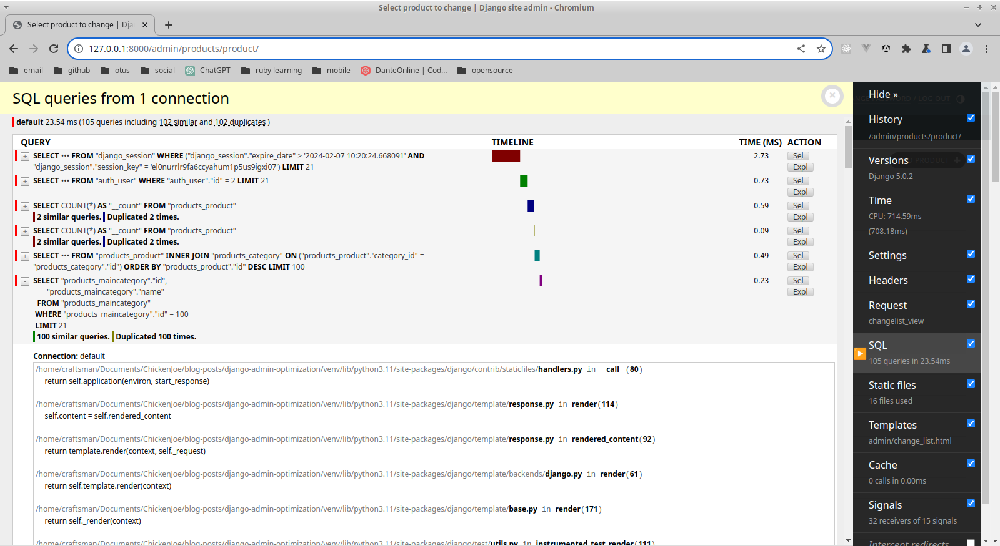
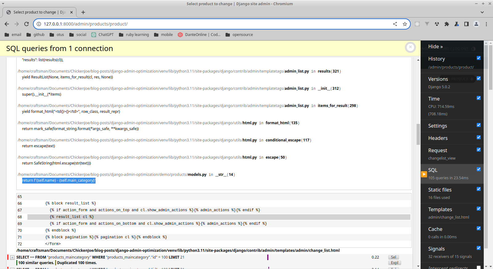
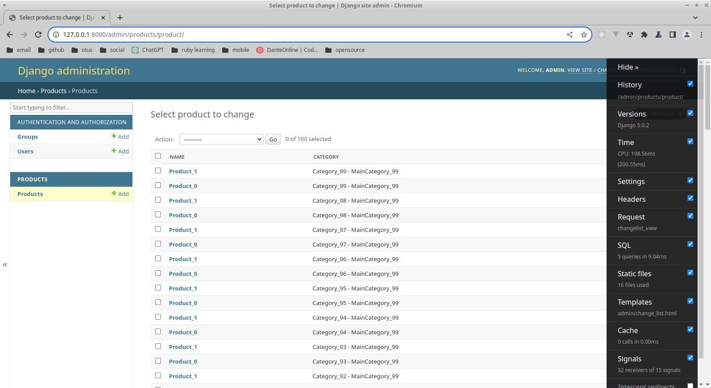
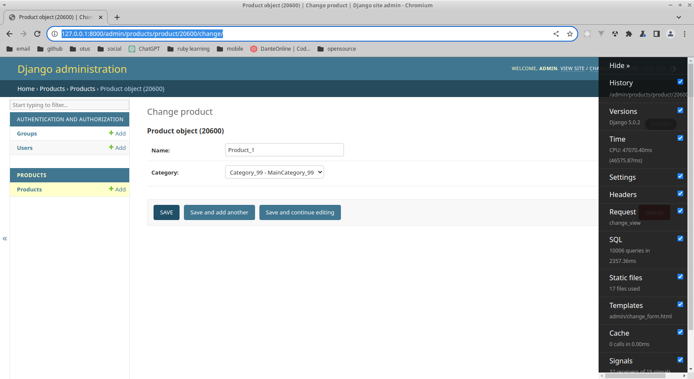

# Django Admin Optimization

## Timestamp

07 february 2024

## Issue

Tomorrow I had a problem with #django-admin. It's about query #optimization in **DetailView**.
I found solutions for **ListView** but not for **DetailView**.
That's why I wrote this post and solve the problem myself.

I want to explain the problem and the solution step by step. Let's start

## Creating Demo Project

You can check all project code [here](demo)

### Install Django Framework

    pip install django

`Django==5.0.2` was installed

### Create Django Project (using venv)

     python -m django startproject demo

### Create Django application

    python manage.py startapp products

### Create Demo models

In `demo/products/models.py`:

```python
from django.db import models

class MainCategory(models.Model):
    name = models.CharField(max_length=16)

    def __str__(self):
        return self.name

class Category(models.Model):
    name = models.CharField(max_length=16)
    main_category = models.ForeignKey(MainCategory, null=True, blank=True, on_delete=models.SET_NULL)

    def __str__(self):
        return f'{self.name} - {self.main_category}'


class Product(models.Model):
    name = models.CharField(max_length=16)
    category = models.ForeignKey(Category, on_delete=models.CASCADE)
```

### Make Migrations

Add application to `INSTALLED_APPS` in `demo/demo/settings.py`:

```python
INSTALLED_APPS = [
    'django.contrib.admin',
    'django.contrib.auth',
    'django.contrib.contenttypes',
    'django.contrib.sessions',
    'django.contrib.messages',
    'django.contrib.staticfiles',
    'products',
]
```

Make migrations:

    python manage.py makemigrations

Migrate:
    
    python manage.py migrate

### Fill DB with test data

1. In `demo/products` create `management` package
2. In `demo/products/management` create `commands` package
3. In `demo/products/management/commands` create `fill_db.py` with code:

```python
from django.core.management.base import BaseCommand
from django.contrib.auth.models import User
from products.models import Category, Product, MainCategory


class Command(BaseCommand):
    help = "Fill Db"

    def handle(self, *args, **options):
        MainCategory.objects.all().delete()

        main_categories = []
        for i in range(100):
            category = MainCategory(name=f'MainCategory_{i}')
            main_categories.append(category)

        MainCategory.objects.bulk_create(main_categories)

        main_categories = MainCategory.objects.all()

        categories = []
        for main_category in main_categories:
            for i in range(100):
                category = Category(name=f'Category_{i}', main_category=main_category)
                categories.append(category)

        Category.objects.bulk_create(categories)

        categories = Category.objects.all()

        products = []
        for category in categories:
            for i in range(2):
                product = Product(category=category, name=f'Product_{i}')
                products.append(product)

        Product.objects.bulk_create(products)

        User.objects.all().delete()
        User.objects.create_superuser('admin', 'admin@admin.com', 'admin')
```

### Add models to Django Admin

In `products/admin.py`:

```python
from django.contrib import admin
from .models import Product

class ProductAdmin(admin.ModelAdmin):
    list_display = ['name', 'category']

admin.site.register(Product, ProductAdmin)
```

### Install django-debug-toolbar

    pip install django-debug-toolbar

`django-debug-toolbar==4.3.0` was installed.
Add `django-debug-toolbar` to installed apps in `demo/settings.py`:

```python
INSTALLED_APPS = [
    'django.contrib.admin',
    'django.contrib.auth',
    'django.contrib.contenttypes',
    'django.contrib.sessions',
    'django.contrib.messages',
    'django.contrib.staticfiles',
    'products',
    'debug_toolbar',
]
```

In `demo/urls` add `django-debug-toolbar` urls:

```python
from django.contrib import admin
from django.urls import path, include

urlpatterns = [
    path('admin/', admin.site.urls),
    path("__debug__/", include("debug_toolbar.urls")),
]
```

In `demo/settings` add `django-debug-toolbar` middleware:

```python
MIDDLEWARE = [
    'django.middleware.security.SecurityMiddleware',
    'django.contrib.sessions.middleware.SessionMiddleware',
    'django.middleware.common.CommonMiddleware',
    'django.middleware.csrf.CsrfViewMiddleware',
    'django.contrib.auth.middleware.AuthenticationMiddleware',
    'django.contrib.messages.middleware.MessageMiddleware',
    'django.middleware.clickjacking.XFrameOptionsMiddleware',
    'debug_toolbar.middleware.DebugToolbarMiddleware',
]
```

In `demo/settings` add `INTERNAL_IPS`:

```python
INTERNAL_IPS = [
    "127.0.0.1",
]
```

### Run server and check Django Admin

    python manage.py runserver

Let's go to `http://127.0.0.1:8000/admin/products/product/` and auth as `admin` `admin`

We should see something like this:


We have **105** sql queries on page. This is the **First** problem to solve

## Problem in ListView

### Explanation

If we open SQL tab we can find **100 duplicated queries**



This queries for `main_category` table.
We can see that `django` send queries thin `__str__` method was being used



### Solution

We need to join `main_category` table to query when we get data.
Add 
```python
list_select_related = ['category__main_category']
```
in `demo/products/admin.py`:

```python
from django.contrib import admin
from .models import Product

class ProductAdmin(admin.ModelAdmin):
    list_display = ['name', 'category']
    list_select_related = ['category__main_category']

admin.site.register(Product, ProductAdmin)
```



**Done** - now we have only 5 queries.

You can find the solution of this problem in other articles.
But let's go to **DetailView** and check `http://127.0.0.1:8000/admin/products/product/20600/change/` this page

## DetailView optimization in Django Admin

What happend? We have 10006 queries on this page. It's to many!



Then I was trying to open sql tab my browser and IDE crushed.

### Reduce database objects count

Let's change `fill_db` script in `demo/products/management/commands/fill_db.py:

```python
from django.core.management.base import BaseCommand
from django.contrib.auth.models import User
from products.models import Category, Product, MainCategory


class Command(BaseCommand):
    help = "Fill Db"

    def handle(self, *args, **options):
        MainCategory.objects.all().delete()

        main_categories = []
        for i in range(5):
            category = MainCategory(name=f'MainCategory_{i}')
            main_categories.append(category)

        MainCategory.objects.bulk_create(main_categories)

        main_categories = MainCategory.objects.all()

        categories = []
        for main_category in main_categories:
            for i in range(5):
                category = Category(name=f'Category_{i}', main_category=main_category)
                categories.append(category)

        Category.objects.bulk_create(categories)

        categories = Category.objects.all()

        products = []
        for category in categories:
            for i in range(2):
                product = Product(category=category, name=f'Product_{i}')
                products.append(product)

        Product.objects.bulk_create(products)

        User.objects.all().delete()
        User.objects.create_superuser('admin', 'admin@admin.com', 'admin')
```

I've just changed 100 to 5. Then run the script:

    python manage.py fill_db

Let's check our page again `http://127.0.0.1:8000/admin/products/product/40850/change/`

Okay, now we have 31 queries: 


25 similar queries:


We can see that django send the query again in `__str__` method:


But in this case it happens when data was loaded in `select`.
And `list_select_related` doesn't work.